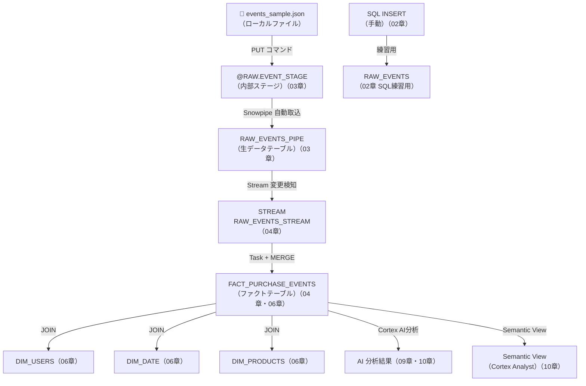

# Snowflake Hands-On for Beginners

`SELECT` は書けるが、Snowflake のパイプライン構築、バッチ処理、AI 関数、基本的なデータモデリングはこれから、という学習者向けの教材です。

この教材の方針:

- 先に動くコードを貼る
- その後で短く意味を確認する
- `RAW -> STAGING -> MART` の流れで統一する
- `正規化`、`非正規化`、`スタースキーマ` を軽く入れる
- `dbt` と `Airflow` は最小サンプルで役割を掴む

## 使い方

> 第12章（dbt）と第13章（Airflow）は SQL 実行章ではなく、各フォルダのサンプルコードを参照しながら進める章です。

| 章 | テーマ | 教材テキスト | SQL ファイル |
|---|---|---|---|
| 第0章 | 環境準備 | [教材を読む](sql/00_setup.md) | [00_setup.sql](sql/00_setup.sql) |
| 第1章 | データモデリングの基本 | [教材を読む](sql/01_modeling_basics.md) | [01_modeling_basics.sql](sql/01_modeling_basics.sql) |
| 第2章 | JSON と VARIANT | [教材を読む](sql/02_json_variant.md) | [02_json_variant.sql](sql/02_json_variant.sql) |
| 第3章 | ファイル取り込み（Snowpipe） | [教材を読む](sql/03_snowpipe.md) | [03_snowpipe.sql](sql/03_snowpipe.sql) |
| 第4章 | 増分バッチ（Streams & Tasks） | [教材を読む](sql/04_streams_tasks.md) | [04_streams_tasks.sql](sql/04_streams_tasks.sql) |
| 第5章 | 処理の再利用と宣言的更新（ストアドプロシージャ・Dynamic Table） | [教材を読む](sql/05_stored_proc_dynamic_table.md) | [05_stored_proc_dynamic_table.sql](sql/05_stored_proc_dynamic_table.sql) |
| 第6章 | スタースキーマの構築 | [教材を読む](sql/06_star_schema.md) | [06_star_schema.sql](sql/06_star_schema.sql) |
| 第7章 | 分析の入口を作る（View / Secure View） | [教材を読む](sql/07_views.md) | [07_views.sql](sql/07_views.sql) |
| 第8章 | コスト最適化の基本 | [教材を読む](sql/08_cost_optimization.md) | [08_cost_optimization.sql](sql/08_cost_optimization.sql) |
| 第9章 | AI 関数（Snowflake Cortex） | [教材を読む](sql/09_ai_sql.md) | [09_ai_sql.sql](sql/09_ai_sql.sql) |
| 第10章 | セマンティックビュー・Cortex Analyst・Cortex Search | [教材を読む](sql/10_semantic_view_cortex.md) | [10_semantic_view_cortex.sql](sql/10_semantic_view_cortex.sql) |
| 第11章 | 全体パイプラインの復習 | [教材を読む](sql/11_end_to_end_pipeline.md) | [11_end_to_end_pipeline.sql](sql/11_end_to_end_pipeline.sql) |
| 第12章 | dbt 入門 | [教材を読む](sql/12_dbt.md) | [dbt/ フォルダ](dbt/) |
| 第13章 | Airflow 入門 | [教材を読む](sql/13_airflow.md) | [airflow/ フォルダ](airflow/) |

## 付録：SnowPro Core 試験対策

本編（00〜13 章）を終えた後、SnowPro Core 試験の頻出ドメインを付録で補完できます。

| 付録 | テーマ | カバードメイン | 教材テキスト | SQL ファイル |
|---|---|---|---|---|
| 付録A1 | アーキテクチャ詳細・マイクロパーティション | D1（25%） | [教材を読む](sql/A1_architecture.md) | [A1_architecture.sql](sql/A1_architecture.sql) |
| 付録A2 | Time Travel / Fail-safe / Zero-Copy Cloning | D1・D6（35%） | [教材を読む](sql/A2_time_travel_cloning.md) | [A2_time_travel_cloning.sql](sql/A2_time_travel_cloning.sql) |
| 付録A3 | セキュリティ・RBAC・データマスキング | D2（20%） | [教材を読む](sql/A3_security_rbac.md) | [A3_security_rbac.sql](sql/A3_security_rbac.sql) |
| 付録A4 | Secure Data Sharing | D1・D6 | [教材を読む](sql/A4_data_sharing.md) | [A4_data_sharing.sql](sql/A4_data_sharing.sql) |
| 付録A5 | パフォーマンス詳細（キャッシュ・クラスタリング） | D4（15%） | [教材を読む](sql/A5_performance_clustering.md) | [A5_performance_clustering.sql](sql/A5_performance_clustering.sql) |
| 付録A6 | Snowpark 入門（Python） | D3（20%） | [教材を読む](sql/A6_snowpark.md) | — |

## 学習ゴール

この教材を終えると、次を説明できる状態を目指します。

- JSON を `VARIANT` で扱う
- `Snowpipe` でファイル取り込みを自動化する
- `Streams + Tasks` で増分バッチを組む
- `fact` と `dimension` を分ける理由を理解する
- View を分析の入口として使う理由を理解する
- Snowflake の基本的なコスト最適化を説明する
- `AI_COMPLETE`、`AI_CLASSIFY`、`AI_EXTRACT` を SQL から使う
- ストアドプロシージャと Dynamic Table の使い分けを説明する
- Semantic View でビジネス定義（メトリクス・ディメンション）をDBに登録する
- Cortex Analyst で自然言語クエリを実現する仕組みを理解する
- Cortex Search でハイブリッド検索サービスを構築する
- `dbt` と `Airflow` の役割差を説明する

## ディレクトリ構成

```text
snowflake-hands-on/
  README.md
  datasets/
    events_sample.json
  sql/
    00_setup.sql
    01_modeling_basics.sql
    02_json_variant.sql
    03_snowpipe.sql
    04_streams_tasks.sql
    05_stored_proc_dynamic_table.sql
    06_star_schema.sql
    07_views.sql
    08_cost_optimization.sql
    09_ai_sql.sql
    10_semantic_view_cortex.sql
    11_end_to_end_pipeline.sql
  dbt/
    profiles.example.yml
    dbt_project.yml
    models/
      schema.yml
      stg_events.sql
      stg_event_items.sql
      dim_users.sql
      dim_products.sql
      fct_purchase_events.sql
  airflow/
    snowflake_event_pipeline.py
```

## 前提

- Snowflake の worksheet が使える
- `CREATE DATABASE`, `CREATE WAREHOUSE`, `CREATE STAGE`, `CREATE PIPE`, `CREATE TASK` ができる権限がある
- AI 関数を試す場合は `SNOWFLAKE.CORTEX_USER` が必要
- Semantic View / Cortex Analyst / Cortex Search は、アカウントやリージョン、権限によって利用できない場合がある
- Airflow と dbt はこの教材では「最小構成の読み物 + コピペ用サンプル」

## 題材

題材は EC サイトのイベントログです。イベント JSON は以下のような形です。

- イベント単位:
  `event_id`, `user_id`, `event_type`, `event_time`, `device`, `review_text`
- 明細単位:
  `items[*].sku`, `items[*].qty`, `items[*].price`

この 1 つの題材で、次の 3 つをつなげます。

- アプリに近い生データの保持
- 分析しやすい形への変換
- AI 関数によるテキスト処理

### テーブル対応表

| テーブル | 作成ファイル | スキーマ | 役割 |
|---|---|---|---|
| RAW_EVENTS | 02_json_variant.sql | RAW | SQL INSERT で入れた練習用 JSON |
| RAW_EVENTS_PIPE | 03_snowpipe.sql | RAW | ファイルから COPY INTO する本線用 JSON |
| RAW_EVENTS_STREAM | 04_streams_tasks.sql | RAW | RAW_EVENTS_PIPE の差分を提供する Stream |
| STG_EVENTS | 02_json_variant.sql | STAGING | イベント単位に整形（1イベント1行） |
| STG_EVENT_ITEMS | 02_json_variant.sql | STAGING | 商品明細単位に展開（1商品1行） |
| REVIEWS | 09_ai_sql.sql | STAGING | AI 関数のテスト用レビューデータ |
| FACT_PURCHASE_EVENTS | 04_streams_tasks.sql | MART | 購入イベントのファクトテーブル |
| DYN_STG_EVENTS | 05_stored_proc_dynamic_table.sql | STAGING | Dynamic Table（RAW_EVENTS_PIPE を常時展開） |
| SEM_PURCHASE_EVENTS | 10_semantic_view_cortex.sql | MART | ビジネス定義を登録した Semantic View |
| REVIEW_SEARCH | 10_semantic_view_cortex.sql | STAGING | レビューのフルテキスト+ベクトル検索サービス |
| DIM_USERS | 06_star_schema.sql | MART | ユーザーのディメンションテーブル |
| DIM_PRODUCTS | 06_star_schema.sql | MART | 商品のディメンションテーブル |
| DIM_DATE | 06_star_schema.sql | MART | 日付のディメンションテーブル |

## 章ごとの見方

各 SQL ファイルは同じ読み方にしています。

- `What you learn`: この章の目的
- `Run this first`: 最初にそのまま実行する SQL
- `Check`: 結果確認用の SQL
- `Try this`: 1 つだけ自分で変える練習

## 設計の考え方

この教材では、設計を次の 3 層で整理します。

- `RAW`: 元データをなるべくそのまま置く
- `STAGING`: 列型や粒度を整える
- `MART`: 集計や BI で使いやすい形にする

また、設計用語は次のレベルで押さえれば十分です。

- `正規化`: 重複を減らし更新しやすくする
- `非正規化`: 読みやすさや集計しやすさのために列を持たせる
- `スタースキーマ`: `fact` と `dimension` に分ける

### データフロー図



## 用語早見表

| 用語 | 一言説明 | 第X章 |
|---|---|---|
| VARIANT | JSON などの半構造化データを格納できる Snowflake の型 | 第02章 |
| Stage | ファイルを一時的に置く場所。internal（Snowflake 内）と external（S3 等）がある | 第03章 |
| Snowpipe | Stage に置かれたファイルを自動または手動で取り込む仕組み | 第03章 |
| Stream | テーブルの変更差分（INSERT/UPDATE/DELETE）を追跡するオブジェクト | 第04章 |
| Task | SQL を定期実行するスケジューラー。CRON 式でスケジュールを指定 | 第04章 |
| LATERAL FLATTEN | JSON 配列を1要素1行に展開する構文 | 第02章 |
| metadata$action | Stream が付与する操作種別（'INSERT' / 'DELETE'） | 第04章 |
| COPY INTO | Stage からテーブルへファイルをロードするコマンド | 第03章 |
| MERGE | 条件に応じて UPDATE / INSERT を切り替えるアップサート構文 | 第04章 |
| スタースキーマ | FACT（計測値）と DIMENSION（属性）を分けるデータモデル | 第06章 |
| Semantic View | メトリクス・ディメンション・リレーションをDBに登録するビジネス定義オブジェクト | 第10章 |
| Cortex Analyst | Semantic View を使って自然言語の質問を SQL に変換する AI 機能 | 第10章 |
| Cortex Search | テキストを全文検索とベクトル検索でハイブリッド検索するサービス | 第10章 |

## 学習スケジュール例

### 6日プラン

1. Day 1: `00_setup.sql`, `01_modeling_basics.sql`, `02_json_variant.sql`
2. Day 2: `03_snowpipe.sql`
3. Day 3: `04_streams_tasks.sql`
4. Day 4: `05_stored_proc_dynamic_table.sql`, `06_star_schema.sql`
5. Day 5: `07_views.sql`, `08_cost_optimization.sql`, `09_ai_sql.sql`
6. Day 6: `10_semantic_view_cortex.sql`, `dbt`, `airflow`, `11_end_to_end_pipeline.sql`

### 12日プラン

1. Day 1:  環境準備（00章）
2. Day 2:  データモデリング基本（01章）
3. Day 3:  JSON と VARIANT（02章）
4. Day 4:  ファイル取り込み（03章）
5. Day 5:  増分バッチ（04章）
6. Day 6:  処理の再利用（05章）
7. Day 7:  スタースキーマ（06章）
8. Day 8:  View / Secure View（07章）
9. Day 9:  コスト最適化（08章）
10. Day 10: AI 関数（09章）
11. Day 11: Semantic View・Cortex（10章）
12. Day 12: dbt と Airflow・全体復習（12・13・11章）

### SnowPro Core 対策プラン（付録 A1〜A6）

本編（00〜13 章）を終えた後、以下の順番で付録を学習することを推奨します。

1. 付録A1: アーキテクチャ詳細（Domain 1 の基盤）
2. 付録A2: Time Travel / Cloning（Domain 1・6 の頻出テーマ）
3. 付録A3: RBAC・セキュリティ（Domain 2 の全範囲）
4. 付録A4: Secure Data Sharing（Domain 1・6 の残り）
5. 付録A5: パフォーマンス詳細（Domain 4 の残り）
6. 付録A6: Snowpark（Domain 3 の補完）

## 補足

- `Snowpipe` は SQL だけで完結しないため、`datasets/events_sample.json` を Snowsight から stage にアップロードする手順を 1 回だけ挟みます
- `AI_COMPLETE` の出力はモデルにより多少変わります
- `AI_CLASSIFY` と `AI_EXTRACT` はコストが発生するため、小さなサンプルで試してください

### Snowsight でファイルをアップロードする詳細手順

1. Snowsight にログインし、左メニューの **Data** をクリック
2. **Databases** > **LEARN_DB** > **RAW** > **Stages** を展開
3. **EVENT_STAGE** をクリック
4. 画面右上の **+ Files** ボタンをクリック
5. `datasets/events_sample.json` を選択し、アップロードを完了する
6. アップロード確認: `list @RAW.EVENT_STAGE;` を実行してファイル名が表示されれば成功
