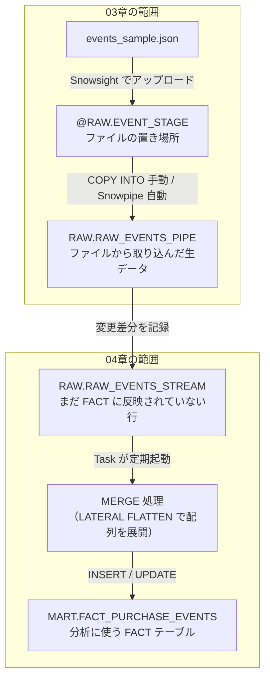

# 第4章: 増分バッチ（Streams & Tasks）

> この章で実行するファイル: `sql/04_streams_tasks.sql`

## この章で学ぶこと

- Stream で RAW テーブルの差分（新着データ）を追跡する
- MERGE で差分を FACT テーブルに反映する
- Task で定期実行のスケジュールを設定する
- Snowflake 内でバッチ処理を自動化する

## 前提条件

- 第0章（`sql/00_setup.sql`）が完了していること
- 第3章（`sql/03_snowpipe.sql`）が完了していること
- `RAW.RAW_EVENTS_PIPE` にデータが存在すること

---

## 全体フロー図（03〜04章の連続性）



---

## 概念解説

### Snowpipe と Stream の役割分担

03章で作った Snowpipe と、この章で作る Stream は異なる役割を持ちます。

| | Snowpipe | Stream |
|---|---|---|
| **役割** | ファイル → テーブルへの取り込み | テーブルの変更差分の追跡 |
| **入力** | Stage 上のファイル（JSON など） | テーブルへの INSERT / UPDATE / DELETE |
| **出力** | テーブル行 | 差分行（`metadata$action` 付き） |
| **使い方** | Stage にファイルを置くと自動実行（または `ALTER PIPE REFRESH` で手動実行） | MERGE / SELECT 時に未処理の差分行を返す |
| **「消費」の概念** | なし（取り込んだファイルは記録されるが次回も再実行できる） | **MERGE が成功するとオフセットが進む**。次回は新しい行だけが返る |

> **まとめ**: Snowpipe は「ファイル置き場→テーブル」のパイプ。Stream は「テーブルの変更→差分ビュー」のセンサー。役割が全く異なる。

---

### なぜ Stream が必要か

Stream なしで毎回 `RAW_EVENTS_PIPE` 全件を MERGE するとどうなるか？

```
RAW_EVENTS_PIPE: 1,000,000 件（毎日1万件ずつ追加される）

【Stream なし（毎回全件 MERGE）】
1回目: 全 1,000,000 件を MERGE → 遅い
2回目: 全 1,000,010 件を MERGE → ほぼ同じ処理量が毎回発生
```

Stream を使うと「最後に読み取ってから追加された行だけ」を追跡できる。

```
【Stream あり（差分のみ MERGE）】
1回目: 全 1,000,000 件を MERGE → Stream のオフセットが進む
2回目: 新規 10 件だけを MERGE → 高速・コスト効率が高い
```

**重要**: Stream から MERGE が成功するとオフセットが進む。MERGE が失敗した場合（ウェアハウスが起動しないなど）はオフセットは進まず、次回の Task 実行時に同じ行が Stream に再度現れる（**べき等性**）。

---

### Stream の仕組み（差分追跡）

```
RAW.RAW_EVENTS_PIPE（テーブル）
        │
        │ 変更を記録
        ▼
RAW.RAW_EVENTS_STREAM（Stream）
        │
        │ SELECT（未処理の差分だけを返す）
        ▼
   MERGE で FACT に反映
        │
        │ ← MERGE 成功でオフセットが進む
```

---

### `metadata$action` の 3 パターン

Stream が変更を記録する際、各行に `metadata$action` という操作種別カラムが付与されます。

| `metadata$action` | 意味 |
|---|---|
| `'INSERT'` | 新規挿入された行 |
| `'DELETE'` | 削除された行 |
| UPDATE | `'DELETE'`（元の値）+ `'INSERT'`（新しい値）の 2 行として記録される |

今回は「新しく追加されたイベントのみ FACT に取り込む」ため、`where s.metadata$action = 'INSERT'` でフィルタしています。

---

### MERGE ON 条件が `event_id + sku` の複合キーである理由

1 つのイベント（1 つの `event_id`）に複数の商品（SKU）が含まれる可能性があります。

```
event_id="e001"
  items = [
    {"sku": "A001", ...},   ← 1 行目（e001 × A001）
    {"sku": "B001", ...}    ← 2 行目（e001 × B001）
  ]
```

`event_id` だけでは「どの商品の行か」を一意に特定できないため、`sku` を加えた複合キーとしています。

```sql
on tgt.event_id = src.event_id
and tgt.sku = src.sku       -- ← sku も加えて複合キー
```

---

### CRON 式の読み方

Task のスケジュールは CRON 式で指定します。

```
'USING CRON 分 時 日 月 曜日 タイムゾーン'
```

| フィールド | 指定例 | 意味 |
|---|---|---|
| 分 | `0` | 0 分 |
| 分 | `0/5` | 0 分始まりで 5 分ごと（0, 5, 10, ...） |
| 時 | `*` | 毎時 |
| 時 | `1` | 1 時 |
| 日 | `*` | 毎日 |
| 月 | `*` | 毎月 |
| 曜日 | `*` | 毎曜日 |
| 曜日 | `1` | 月曜日 |

**よく使うパターン**:

| CRON 式 | 実行タイミング |
|---|---|
| `0/5 * * * * Asia/Tokyo` | 毎 5 分 |
| `0 1 * * * Asia/Tokyo` | 毎日 01:00 JST |
| `0 * * * * Asia/Tokyo` | 毎時 0 分（毎時正時） |
| `0 9 * * 1 Asia/Tokyo` | 毎週月曜 09:00 JST |

---

## ハンズオン手順

### Step 1: Stream を作成する

RAW テーブルの変更を追跡する Stream を作成します。

```sql
create or replace stream RAW.RAW_EVENTS_STREAM
  on table RAW.RAW_EVENTS_PIPE;
```

---

### Step 2: FACT テーブルを作成する

```sql
create or replace table MART.FACT_PURCHASE_EVENTS (
  event_id     string,
  user_id      string,
  event_time   timestamp_ntz,
  sku          string,
  product_name string,  -- 購入時点の商品名を記録（非正規化）
  category     string,  -- 購入時点のカテゴリを記録（非正規化）
  qty          number,
  price        number(10,2),
  line_amount  number(12,2),
  src_filename string,
  inserted_at  timestamp_ntz default current_timestamp()
);
```

**設計メモ**: `product_name` と `category` を FACT に持たせているのは「購入時点の商品情報」を記録するためです。商品マスタが後から変わっても、購入当時の名前・カテゴリが保持されます。

---

### Step 3: 手動で増分 MERGE を実行する

Stream の差分を FACT に MERGE します。まずは手動で実行して動作を確認します。

```sql
merge into MART.FACT_PURCHASE_EVENTS tgt    -- ← 書き込み先（FACT テーブル）
using (
  select
    s.raw:event_id::string as event_id,
    s.raw:user_id::string as user_id,
    to_timestamp_ntz(s.raw:event_time::string) as event_time,
    item.value:sku::string as sku,
    item.value:product_name::string as product_name,
    item.value:category::string as category,
    item.value:qty::number as qty,
    item.value:price::number(10,2) as price,
    item.value:qty::number * item.value:price::number(10,2) as line_amount,
    s.src_filename
  from RAW.RAW_EVENTS_STREAM s,             -- ← Stream から「未処理の新規行のみ」を取得
  lateral flatten(input => s.raw:items) item
  where s.metadata$action = 'INSERT'        -- ← DELETE 行（MERGE 由来）を除外
) src
on tgt.event_id = src.event_id              -- ← 重複チェックのキー（複合）
and tgt.sku = src.sku
when matched then update set                -- ← 既存行の更新（べき等性の確保）
  tgt.qty         = src.qty,
  tgt.price       = src.price,
  tgt.line_amount = src.line_amount,
  ...
when not matched then insert (...)          -- ← 新規行の追加
values (...);
```

MERGE 後の確認:

```sql
-- カテゴリ別売上（5行返ること）
select category, sum(line_amount) as sales
from MART.FACT_PURCHASE_EVENTS
group by category
order by sales desc;

-- 月別件数（3行返ること）
select date_trunc('month', event_time) as month, count(*) as cnt
from MART.FACT_PURCHASE_EVENTS
group by 1
order by 1;
```

---

### Step 4: Task を作成して定期実行を設定する

```sql
create or replace task STAGING.LOAD_FACT_PURCHASE_EVENTS
  warehouse = LEARN_WH
  schedule  = 'USING CRON 0/5 * * * * Asia/Tokyo'  -- 5 分ごと
as
-- ここに Step 3 と同じ MERGE 文を記述（sql/04_streams_tasks.sql を参照）
;

-- Task を開始（デフォルトは SUSPENDED 状態）
alter task STAGING.LOAD_FACT_PURCHASE_EVENTS resume;

-- Task の状態を確認
show tasks like 'LOAD_FACT_PURCHASE_EVENTS' in schema STAGING;

-- 必要に応じて停止
-- alter task STAGING.LOAD_FACT_PURCHASE_EVENTS suspend;
```

> **注意**: Task は作成直後は `SUSPENDED` 状態です。`alter task ... resume` を実行しないとスケジュールが開始されません。

---

## 確認クエリ

```sql
-- Stream の未処理差分を確認（MERGE 後は空になる）
select * from RAW.RAW_EVENTS_STREAM;

-- FACT テーブルの内容確認
select * from MART.FACT_PURCHASE_EVENTS order by event_time, event_id, sku;

-- Task の実行ログを確認
select *
from table(information_schema.task_history())
order by scheduled_time desc
limit 20;
```

---

## Try This

**Task のスケジュールを毎日 01:00 に変えるにはどう書くか考えてみてください。**

<details>
<summary>答え例</summary>

```sql
create or replace task STAGING.LOAD_FACT_PURCHASE_EVENTS
  warehouse = LEARN_WH
  schedule  = 'USING CRON 0 1 * * * Asia/Tokyo'   -- 毎日 01:00 JST
as
-- ... MERGE 文は同じ
;

alter task STAGING.LOAD_FACT_PURCHASE_EVENTS resume;
```

`0 1 * * * Asia/Tokyo` の読み方:
- `0` → 0 分
- `1` → 1 時
- `* * *` → 毎日・毎月・毎曜日
- `Asia/Tokyo` → 日本時間（JST = UTC+9）

</details>

---

## まとめ

| 概念 | ポイント |
|---|---|
| Snowpipe | ファイル → テーブルへの取り込み。Stream とは役割が異なる |
| Stream | テーブルへの変更（差分）を追跡。MERGE 成功でオフセットが進む |
| `metadata$action` | Stream が付与する操作種別（INSERT / DELETE） |
| MERGE | 差分を既存テーブルに「upsert（挿入 or 更新）」する |
| べき等性 | MERGE が失敗してもオフセットは進まず、次回に再処理される |
| 複合キー | `event_id + sku` で 1 明細行を一意に特定 |
| Task | SQL をスケジュール実行するオブジェクト |
| CRON 式 | `分 時 日 月 曜日 タイムゾーン` の書式 |

## よくあるエラーと対処法

| 症状 | 原因 | 対処法 |
|---|---|---|
| Stream のオフセットが進まず、同じ差分が残り続ける | MERGE が未実行、失敗、または Task が `SUSPENDED` のまま | `SHOW TASKS LIKE 'LOAD_FACT_PURCHASE_EVENTS' IN SCHEMA STAGING;` で状態を確認し、必要なら `ALTER TASK STAGING.LOAD_FACT_PURCHASE_EVENTS RESUME;` を実行する |
| Task は作成したのに自動実行されない | 作成直後の Task はデフォルトで停止状態 | `ALTER TASK ... RESUME` を忘れていないか確認し、再作成後も毎回 `RESUME` する |

次の章では、MERGE ロジックをストアドプロシージャとして再利用し、Task DAG でより保守しやすいパイプラインを構築します。

## 参考リンク

- [Stream の概要](https://docs.snowflake.com/en/user-guide/streams-intro)
- [MERGE 文](https://docs.snowflake.com/en/sql-reference/sql/merge)
- [Task の概要](https://docs.snowflake.com/en/user-guide/tasks-intro)
- [TASK_HISTORY 関数](https://docs.snowflake.com/en/sql-reference/functions/task_history)

## 学習チェックリスト

- [ ] Stream を作成して変更データをキャプチャできた
- [ ] `SYSTEM$STREAM_HAS_DATA()` でデータ有無を確認できた
- [ ] Task を作成してスケジュール実行を設定できた
- [ ] Stream + Task による増分バッチ処理の仕組みを説明できる
