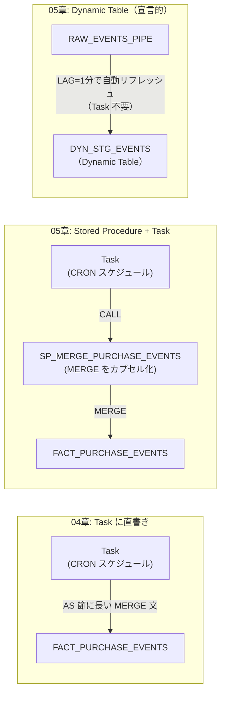
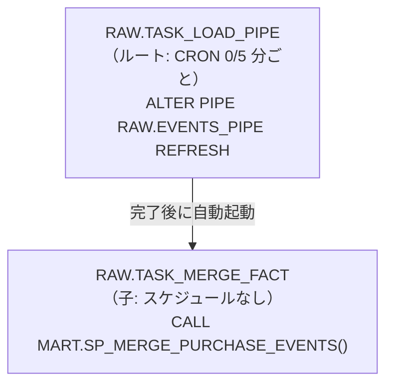

# 第5章: 処理の再利用と宣言的更新（ストアドプロシージャ・Dynamic Table）

> この章で実行するファイル: `sql/05_stored_proc_dynamic_table.sql`

## この章で学ぶこと

- ストアドプロシージャで SQL ロジックを再利用する方法
- Dynamic Table で Stream + Task を宣言的に置き換える方法
- Task の AFTER 句で複数処理を依存関係付きで連鎖させる方法
- Snowflake Alerts で異常を検知・通知する方法

## 前提条件

- 第4章（`sql/04_streams_tasks.sql`）が完了していること
- `MART.FACT_PURCHASE_EVENTS` が作成済みであること

---

## 04章との比較：アプローチの違い



---

## Task DAG の依存関係図



> **起動順序の注意**: Task を resume するときは **子 Task を先に resume し、ルート Task を後で resume** する。
> ルートを先に resume すると、次のスケジュール実行タイミングで子を起動しようとするが、
> そのとき子が suspended のままだと子が動かない。子を先に resume することで初回実行から確実に全ステップが動く。

---

## 概念解説

### 手続き的アプローチ vs 宣言的アプローチ

第4章では「Stream を読んで → MERGE する → Task でスケジュール実行する」という **手続き的** なパイプラインを作りました。この章では同じ結果を 2 つのアプローチで実現します。

---

### ストアドプロシージャとは

SQL ロジックをまとめて **名前を付けて再利用** できるオブジェクトです。

- `CREATE PROCEDURE` で定義し、`CALL` で実行する
- 変数・条件分岐・ループが使える（Snowflake Scripting）
- Task の AS 節に長い MERGE 文を書く代わりに `CALL procedure_name()` と書ける

```sql
-- 定義
CREATE OR REPLACE PROCEDURE MART.SP_MERGE_PURCHASE_EVENTS()
  RETURNS STRING
  LANGUAGE SQL
AS $$
  MERGE INTO MART.FACT_PURCHASE_EVENTS ...;
  RETURN '完了';
$$;

-- 実行（手動でも Task からでも同じ CALL 文）
CALL MART.SP_MERGE_PURCHASE_EVENTS();
```

---

### Dynamic Table とは

`SELECT` 文の結果を常に最新の状態に保ち続けるテーブルです。

```sql
CREATE OR REPLACE DYNAMIC TABLE STAGING.DYN_STG_EVENTS
  LAG       = '1 minute'   -- 最大 1 分の遅延を許容してリフレッシュ
  WAREHOUSE = LEARN_WH
AS
  SELECT
    raw:event_id::STRING AS event_id,
    ...
  FROM RAW.RAW_EVENTS_PIPE;
```

`LAG = '1 minute'` は「最大 1 分前のデータまで許容する」という新鮮さの設定です。`LAG = '0'` にすると即時リフレッシュ（コストが高い）。

---

### どれを使うべきか：選択基準

| | Task + 直書き MERGE（04章） | Stored Procedure + Task（05章） | Dynamic Table（05章） |
|---|---|---|---|
| **向いている場面** | 学習・1回きりのシンプル ETL | ロジックを複数箇所から再利用したい | 宣言的に定義したい・遅延 1 分 OK |
| **ロジックの保守性** | △ Task に埋め込み（変更時は Task を再作成） | ◎ SP で一元管理（CALL 側は変えなくてよい） | ◎ SELECT 文のみ（シンプル） |
| **複雑なロジック** | ○ | ◎ 変数・分岐・ループも使える | △ SELECT で表現可能な範囲のみ |
| **手動テスト** | △ MERGE 文をそのままコピーして実行 | ◎ `CALL SP_NAME()` 1 行で実行できる | ◎ Dynamic Table を直接 SELECT で確認 |
| **他のシステムとの連携** | ○ Task から外部 API は呼べない | ◎ SP 内で EXTERNAL FUNCTION や Python 呼び出しが可能 | △ SELECT で表現可能な範囲のみ |

**実践的な使い分け**:
- **最初のプロトタイプ**: Task + 直書き MERGE（04章スタイル）でシンプルに作る
- **保守・チーム開発**: ロジックが複雑になってきたら SP に切り出す
- **ステージング変換**: SELECT で表現できる変換処理なら Dynamic Table が最もシンプル

---

### Task DAG の「子を先に resume する理由」

```
【間違った順序】
1. ルート Task を resume → 次のスケジュール（5分後）が有効になる
2. 子 Task を resume    → しかし 5分後の実行タイミングに間に合わない場合がある
   → ルートが完了しても子が suspended のまま → 子が動かない!

【正しい順序】
1. 子 Task を resume    → 子は suspended が解除されて待機状態に
2. ルート Task を resume → ルートのスケジュールが有効になる
   → ルートが完了すると子が自動起動 → 正常に動く ✓
```

---

### Task の依存関係（AFTER 句）

複数の Task を DAG（有向非巡回グラフ）として連鎖させるには `AFTER` 句を使います。

```sql
-- ルート Task（スケジュールあり）
CREATE OR REPLACE TASK RAW.TASK_LOAD_PIPE
  WAREHOUSE = LEARN_WH
  SCHEDULE  = 'USING CRON 0/5 * * * * Asia/Tokyo'
AS
  ALTER PIPE RAW.EVENTS_PIPE REFRESH;

-- 子 Task（AFTER で依存を定義。スケジュールは不要）
CREATE OR REPLACE TASK RAW.TASK_MERGE_FACT
  WAREHOUSE = LEARN_WH
  AFTER     RAW.TASK_LOAD_PIPE          -- ← ここで依存を定義
AS
  CALL MART.SP_MERGE_PURCHASE_EVENTS();

-- resume は子 → ルートの順
ALTER TASK RAW.TASK_MERGE_FACT RESUME;   -- ① 子を先に resume
ALTER TASK RAW.TASK_LOAD_PIPE  RESUME;   -- ② ルートを resume（これで DAG 全体が動く）
```

---

### Snowflake Alerts

指定した条件が真になったとき、指定した処理（通知・SQL 実行など）を自動実行するオブジェクトです。

```sql
CREATE OR REPLACE ALERT MART.ALERT_EMPTY_FACT
  WAREHOUSE = LEARN_WH
  SCHEDULE  = '5 MINUTE'
  IF (EXISTS (
    SELECT 1 FROM MART.FACT_PURCHASE_EVENTS HAVING COUNT(*) = 0
  ))
  THEN CALL SYSTEM$SEND_EMAIL(...);
```

---

## ハンズオン手順

### Step 1: ストアドプロシージャを作成する

第4章の MERGE ロジックをプロシージャ化します。CALL 1 行でテストできるのが大きなメリットです。

```sql
-- 04章の「Task に直書きしていた MERGE 文」を SP としてカプセル化
-- メリット:
--   - CALL SP_MERGE_PURCHASE_EVENTS() 1行で実行・テストできる
--   - Task の AS 節がシンプルになる
--   - SP を修正すれば Task 側は変更不要
CREATE OR REPLACE PROCEDURE MART.SP_MERGE_PURCHASE_EVENTS()
  RETURNS STRING
  LANGUAGE SQL
AS $$
  MERGE INTO MART.FACT_PURCHASE_EVENTS tgt
  USING (
    SELECT
      s.raw:event_id::STRING    AS event_id,
      s.raw:user_id::STRING     AS user_id,
      TO_TIMESTAMP_NTZ(s.raw:event_time::STRING) AS event_time,
      item.value:sku::STRING    AS sku,
      item.value:product_name::STRING AS product_name,
      item.value:category::STRING     AS category,
      item.value:qty::NUMBER          AS qty,
      item.value:price::NUMBER(10,2)  AS price,
      item.value:qty::NUMBER * item.value:price::NUMBER(10,2) AS line_amount,
      s.src_filename
    FROM RAW.RAW_EVENTS_STREAM s,
    LATERAL FLATTEN(INPUT => s.raw:items) item
    WHERE s.metadata$action = 'INSERT'
  ) src
  ON tgt.event_id = src.event_id AND tgt.sku = src.sku
  WHEN MATCHED THEN UPDATE SET
    tgt.qty = src.qty, tgt.price = src.price, tgt.line_amount = src.line_amount
  WHEN NOT MATCHED THEN INSERT (
    event_id, user_id, event_time, sku, product_name, category,
    qty, price, line_amount, src_filename
  ) VALUES (
    src.event_id, src.user_id, src.event_time, src.sku, src.product_name, src.category,
    src.qty, src.price, src.line_amount, src.src_filename
  );
  RETURN '完了';
$$;
```

動作確認:

```sql
-- 手動実行（04章の MERGE 手動実行と同じ結果になる）
CALL MART.SP_MERGE_PURCHASE_EVENTS();

-- 結果確認
SELECT * FROM MART.FACT_PURCHASE_EVENTS ORDER BY event_time, event_id, sku;
```

---

### Step 2: Dynamic Table を作成する

`RAW_EVENTS_PIPE` のデータを常に展開し続ける Dynamic Table を作成します。Task や Stream の定義が不要で、SELECT 文だけで定義できます。

```sql
-- 宣言的アプローチ: 「このSELECT結果を常に最新に保つ」と宣言するだけ
-- Stream も Task も自分で作らなくてよい
-- LAG = '1 minute': 最大 1 分の遅延を許容してリフレッシュ
--   → リアルタイム性が不要ならコストを抑えられる
--   → 即時性が必要なら LAG = '0'（コスト高）
CREATE OR REPLACE DYNAMIC TABLE STAGING.DYN_STG_EVENTS
  LAG       = '1 minute'
  WAREHOUSE = LEARN_WH
AS
  SELECT
    raw:event_id::STRING    AS event_id,
    raw:user_id::STRING     AS user_id,
    raw:event_type::STRING  AS event_type,
    TO_TIMESTAMP_NTZ(raw:event_time::STRING) AS event_time,
    raw:device::STRING      AS device,
    src_filename,
    loaded_at
  FROM RAW.RAW_EVENTS_PIPE;
```

更新履歴の確認:

```sql
-- 数分待ってから実行するとリフレッシュ記録が見える
SELECT * FROM TABLE(INFORMATION_SCHEMA.DYNAMIC_TABLE_REFRESH_HISTORY(
  NAME => 'STAGING.DYN_STG_EVENTS'
))
ORDER BY refresh_start_time DESC
LIMIT 10;
```

---

### Step 3: Task DAG を組む（AFTER 句）

ストアドプロシージャを Task から呼び出し、2 つの Task を依存関係で連鎖させます。

```sql
-- ルート Task: Pipe を refresh する（ファイル取り込みをトリガー）
CREATE OR REPLACE TASK RAW.TASK_LOAD_PIPE
  WAREHOUSE = LEARN_WH
  SCHEDULE  = 'USING CRON 0/5 * * * * Asia/Tokyo'
AS
  ALTER PIPE RAW.EVENTS_PIPE REFRESH;

-- 子 Task: ルート完了後に SP を CALL する
-- AFTER 句でルートを指定するだけ。スケジュールは不要。
CREATE OR REPLACE TASK RAW.TASK_MERGE_FACT
  WAREHOUSE = LEARN_WH
  AFTER     RAW.TASK_LOAD_PIPE
AS
  CALL MART.SP_MERGE_PURCHASE_EVENTS();

-- ① 子を先に resume（重要！）
ALTER TASK RAW.TASK_MERGE_FACT RESUME;

-- ② ルートを resume（これで DAG 全体が起動する）
ALTER TASK RAW.TASK_LOAD_PIPE  RESUME;
```

実行ログの確認:

```sql
SELECT *
FROM TABLE(INFORMATION_SCHEMA.TASK_HISTORY())
ORDER BY scheduled_time DESC
LIMIT 20;
```

---

### Step 4: Alert を作成する

`FACT_PURCHASE_EVENTS` が空になったときに通知するアラートを作成します。

```sql
CREATE OR REPLACE ALERT MART.ALERT_EMPTY_FACT
  WAREHOUSE = LEARN_WH
  SCHEDULE  = '5 MINUTE'
  IF (EXISTS (
    SELECT 1 FROM MART.FACT_PURCHASE_EVENTS HAVING COUNT(*) = 0
  ))
  THEN
    CALL SYSTEM$SEND_EMAIL(
      'your-email@example.com',
      'ALERT: FACT_PURCHASE_EVENTS が空です',
      'MART.FACT_PURCHASE_EVENTS の件数が 0 件になりました。パイプラインを確認してください。'
    );

ALTER ALERT MART.ALERT_EMPTY_FACT RESUME;
```

> **注意**: `SYSTEM$SEND_EMAIL` を使うには、事前に Snowflake の通知統合（NOTIFICATION INTEGRATION）の設定が必要です。動作確認だけなら、THEN 節を `SELECT 'alert triggered'` に変えてテストできます。

---

## 確認クエリ

```sql
-- プロシージャの一覧
SHOW PROCEDURES IN SCHEMA MART;

-- Dynamic Table の状態確認
SHOW DYNAMIC TABLES IN SCHEMA STAGING;

-- Task の状態確認（AFTER 依存関係も確認できる）
SHOW TASKS IN SCHEMA RAW;

-- Alert の状態確認
SHOW ALERTS IN SCHEMA MART;
```

---

## Try This

1. **MERGE procedure にパラメータを追加してみる**

   `SP_MERGE_PURCHASE_EVENTS` のシグネチャを変更し、対象スキーマ名（`'MART'`）をパラメータとして受け取れるようにしてみましょう。

   ヒント: `RETURNS STRING LANGUAGE SQL` の前に `(target_schema STRING)` を追加し、プロシージャ本体内で動的スキーマ名を使います。

2. **Dynamic Table の LAG を変えてみる**

   `LAG = '1 minute'` を `LAG = '5 minutes'` に変更して、更新頻度がどう変わるか `DYNAMIC_TABLE_REFRESH_HISTORY` で確認してみましょう。

---

## まとめ

| 概念 | ポイント |
|---|---|
| Stored Procedure | SQL ロジックを名前付きでカプセル化。`CALL` で再利用。手動テストしやすい |
| Dynamic Table | `SELECT` を定義するだけで、更新はシステムが管理（宣言的） |
| Task AFTER 句 | 複数 Task を DAG として連鎖。ルート Task のスケジュールで全体が動く |
| resume 順序 | **子 Task を先に resume → ルート Task を後で resume** |
| Alerts | 条件が真になったとき自動的に処理を実行（監視・通知） |
| TASK_HISTORY | Task の実行ログ・エラーを確認する関数 |

次の章では、`FACT_PURCHASE_EVENTS` から DIM テーブルを作成してスタースキーマを完成させます。

## 参考リンク

- [ストアドプロシージャの概要](https://docs.snowflake.com/en/developer-guide/stored-procedure/stored-procedures-overview)
- [CREATE PROCEDURE](https://docs.snowflake.com/en/sql-reference/sql/create-procedure)
- [Dynamic Table の概要](https://docs.snowflake.com/en/user-guide/dynamic-tables-intro)
- [CREATE DYNAMIC TABLE](https://docs.snowflake.com/en/sql-reference/sql/create-dynamic-table)
- [Task の依存関係（DAG）](https://docs.snowflake.com/en/user-guide/tasks-graphs)
- [Snowflake Alerts の概要](https://docs.snowflake.com/en/user-guide/alerts)
- [CREATE ALERT](https://docs.snowflake.com/en/sql-reference/sql/create-alert)
