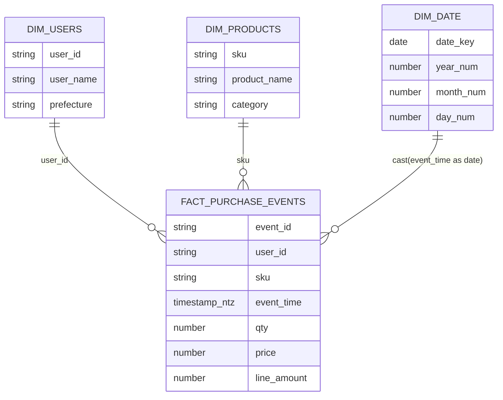

# 第6章: スタースキーマの構築

> この章で実行するファイル: `sql/06_star_schema.sql`

## この章で学ぶこと

- FACT テーブルから DIM テーブルを派生させる
- スタースキーマを使った集計クエリを書く
- MART 層で分析しやすいデータ構造を完成させる

## 前提条件

- 第0章（`sql/00_setup.sql`）が完了していること
- 第4章（`sql/04_streams_tasks.sql`）が完了していること
- `MART.FACT_PURCHASE_EVENTS` にデータが存在すること

---

## 概念解説

### この章の位置づけ

04章で作った `FACT_PURCHASE_EVENTS`（購入イベントのファクト）から、DIM（ディメンション）テーブルを派生させてスタースキーマを完成させます。

```
MART.FACT_PURCHASE_EVENTS
（購入イベントの全情報を含む）
          │
          ├──→ DIM_USERS      （ユーザー属性）
          ├──→ DIM_PRODUCTS   （商品属性）
          └──→ DIM_DATE       （日付属性）
```

**スタースキーマの定義**:
- **FACT テーブル**: 計測値（金額・数量）と外部キーを持つ中央のテーブル
- **DIM テーブル**: 属性情報（名前・カテゴリ・地域）を持つ周辺のテーブル

### スタースキーマのリレーション



この章では `FACT_PURCHASE_EVENTS` が中心にあり、`user_id`、`sku`、`cast(event_time as date)` をキーに周辺の DIM と JOIN します。

### テーブル役割表

| テーブル | 種別 | 主キー | 行数目安 | 役割 |
|---|---|---|---|---|
| `FACT_PURCHASE_EVENTS` | ファクト | `event_id + sku` | 大 | 購入イベント明細。数量・単価・金額などの計測値を持つ |
| `DIM_USERS` | ディメンション | `user_id` | 小 〜 中 | ユーザー属性を持つ。今回は `user_name` と `prefecture` を付与 |
| `DIM_PRODUCTS` | ディメンション | `sku` | 小 | 商品名やカテゴリなどの商品マスタ属性を持つ |
| `DIM_DATE` | ディメンション | `date_key` | 小 | 日付粒度で年・月・日を持ち、時系列集計を簡単にする |

### なぜスタースキーマにするのか

3NF のような正規化モデルは更新整合性には強い一方で、分析時には JOIN が増えやすくなります。逆に snowflake schema のように DIM をさらに正規化すると、属性管理は細かくできても学習初期には構造が複雑になります。

この教材でスタースキーマを採る理由は次のとおりです。

- 集計クエリが `FACT + 必要な DIM` の JOIN に揃い、読みやすい
- BI やセマンティックレイヤーに載せるときに、メトリクスと属性の役割を分けやすい
- 学習段階で「計測値は FACT、説明属性は DIM」という基本形をつかみやすい

---

## ハンズオン手順

### Step 1: DIM_USERS を作成する

FACT テーブルに含まれる `user_id` から DIM を作成します。

```sql
create or replace table MART.DIM_USERS as
select distinct
  user_id,
  case
    when user_id = 'u001' then 'Aki'
    when user_id = 'u002' then 'Mina'
    else 'Unknown'
  end as user_name,
  case
    when user_id = 'u001' then 'Tokyo'
    when user_id = 'u002' then 'Osaka'
    else 'Unknown'
  end as prefecture
from MART.FACT_PURCHASE_EVENTS;
```

> **注意**: `user_name` と `prefecture` は `CASE WHEN` でダミーデータを設定しています。これは学習用の簡略化で、本来はユーザーマスタテーブル（CRM など）から取得します。

---

### Step 2: DIM_PRODUCTS を作成する

FACT テーブルに購入時点の商品情報が非正規化されているため、それを `distinct` で集約します。

```sql
create or replace table MART.DIM_PRODUCTS as
select distinct
  sku,
  product_name,
  category
from MART.FACT_PURCHASE_EVENTS;
```

---

### Step 3: DIM_DATE を作成する

FACT のイベント時刻から日付ディメンションを生成します。

```sql
create or replace table MART.DIM_DATE as
select distinct
  cast(event_time as date) as date_key,
  year(event_time) as year_num,
  month(event_time) as month_num,
  day(event_time) as day_num
from MART.FACT_PURCHASE_EVENTS;
```

---

### Step 4: スタースキーマで集計する

**集計例1: カテゴリ × 都道府県別の売上**

```sql
select
  d.category,
  u.prefecture,
  sum(f.line_amount) as sales_amount
from MART.FACT_PURCHASE_EVENTS f
join MART.DIM_PRODUCTS d on f.sku = d.sku
join MART.DIM_USERS u on f.user_id = u.user_id
group by d.category, u.prefecture
order by sales_amount desc;
```

**集計例2: 年月 × カテゴリ別の数量・売上**

```sql
select
  dd.year_num,
  dd.month_num,
  d.category,
  sum(f.qty) as total_qty,
  sum(f.line_amount) as sales_amount
from MART.FACT_PURCHASE_EVENTS f
join MART.DIM_PRODUCTS d on f.sku = d.sku
join MART.DIM_DATE dd on cast(f.event_time as date) = dd.date_key
group by dd.year_num, dd.month_num, d.category
order by dd.year_num, dd.month_num, d.category;
```

スタースキーマでは FACT テーブルを中心に DIM テーブルを JOIN するだけで、多角的な集計が可能になります。

---

## 確認クエリ

```sql
select * from MART.DIM_USERS order by user_id;
select * from MART.DIM_PRODUCTS order by sku;
select * from MART.DIM_DATE order by date_key;
```

---

## Try This

**`user_name` ごとの購入金額を集計してください。**

<details>
<summary>答え例</summary>

```sql
select
  u.user_name,
  sum(f.line_amount) as total_amount
from MART.FACT_PURCHASE_EVENTS f
join MART.DIM_USERS u on f.user_id = u.user_id
group by u.user_name
order by total_amount desc;
```

`user_name` は `DIM_USERS` に持っているため、FACT と JOIN して集計します。

</details>

---

## まとめ

この章で完成したスタースキーマの全体像:

```
           DIM_USERS
          (user_id, user_name, prefecture)
                │
                │ JOIN on user_id
                ▼
DIM_PRODUCTS ── FACT_PURCHASE_EVENTS ── DIM_DATE
(sku,            (event_id,              (date_key,
 product_name,    user_id,               year_num,
 category)        sku,                   month_num,
                  qty,                   day_num)
                  price,
                  line_amount)
```

| 作成したテーブル | 内容 |
|---|---|
| `DIM_USERS` | ユーザー属性（名前・都道府県）※ダミーデータ |
| `DIM_PRODUCTS` | 商品属性（商品名・カテゴリ） |
| `DIM_DATE` | 日付属性（年・月・日） |

次の章では、このパイプラインのコスト最適化の基本を学びます。

## 参考リンク

- [テーブル設計の考え方](https://docs.snowflake.com/en/user-guide/table-considerations)
- [CREATE TABLE](https://docs.snowflake.com/en/sql-reference/sql/create-table)
