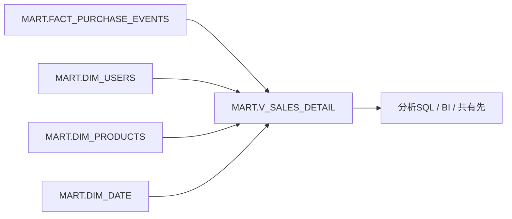

# 第7章: 分析の入口を作る（View / Secure View）

> この章で実行するファイル: `sql/07_views.sql`

## この章で学ぶこと

- View を「長い SQL の保存」ではなく「分析の入口」として使う考え方
- `FACT_PURCHASE_EVENTS` と `DIM_*` をまとめた分析用 View を作る方法
- `VIEW` と `SECURE VIEW` の違い
- `VIEW` / `DYNAMIC TABLE` / `SEMANTIC VIEW` の役割の違い

## 前提条件

- 第6章（`sql/06_star_schema.sql`）が完了していること
- `MART.FACT_PURCHASE_EVENTS`、`MART.DIM_USERS`、`MART.DIM_PRODUCTS`、`MART.DIM_DATE` が存在すること

---

## まず課題を見る

スタースキーマまで作ると、分析はしやすくなります。ただし、毎回こんな SQL を書くのは少し面倒です。

```sql
select
  dd.year_num,
  dd.month_num,
  p.category,
  u.prefecture,
  f.qty,
  f.line_amount
from MART.FACT_PURCHASE_EVENTS f
join MART.DIM_PRODUCTS p
  on f.sku = p.sku
join MART.DIM_USERS u
  on f.user_id = u.user_id
join MART.DIM_DATE dd
  on cast(f.event_time as date) = dd.date_key;
```

1 回だけなら問題ありません。ですが、ダッシュボード、分析 SQL、BI ツール、他チーム向け共有で毎回これを書くと、次の問題が出ます。

- JOIN 条件の書き忘れや列名ブレが起きる
- 利用者が「どのテーブルをつなぐべきか」を毎回考える必要がある
- 列名や粒度の定義が人によってばらつく

ここで使うのが **View** です。

---

## 概念解説

### View は「分析用の入口」

View はデータを持たず、`SELECT` 文だけを名前付きで保存するオブジェクトです。



利用者は `FACT` と `DIM` の JOIN を毎回意識せず、`V_SALES_DETAIL` を起点に集計できます。

### テーブルと View の違い

| 項目 | テーブル | View |
|---|---|---|
| データを保持するか | する | しない |
| 更新方法 | `INSERT` / `MERGE` など | 元の `SELECT` 定義に従う |
| 使いどころ | 保存された実データ | 利用者向けの見せ方・公開面 |
| 向いている場面 | パイプラインの中間結果、実体データ | 分析の入口、列の整理、ロジック共通化 |

### Secure View はいつ使うか

#### 通常の View の問題点

通常の View は、定義（SELECT 文）を誰でも確認できます。

```sql
-- 誰でもビューの定義を見られる
SHOW VIEWS LIKE 'V_SALES_DETAIL';
-- または
SELECT GET_DDL('VIEW', 'MART.V_SALES_DETAIL');
-- → ビューの SELECT 文が丸見え：テーブル構造・JOIN 条件・フィルタ条件がバレる
```

社内の分析用途では問題になりませんが、**外部共有・他部門公開・行レベルセキュリティ**を実装する場面では、この「定義の透過性」がリスクになります。

#### SECURE VIEW が解決すること

`CREATE SECURE VIEW` にするだけで、オーナー以外はビューの定義を参照できなくなります。

| 項目 | 通常 VIEW | SECURE VIEW |
|---|---|---|
| ビュー定義の閲覧（GET_DDL） | 誰でも見える | オーナーのみ |
| Query Profile の詳細 | 表示される | 一部非表示 |
| Data Sharing での安全性 | 定義が漏れる | 安全に共有可能 |

#### 典型的なユースケース

**① Data Sharing（外部アカウントへの共有）**
外部アカウントにビューを共有する際、ビュー定義（元のテーブル名・フィルタ条件）を相手に見せたくない場合。

**② 行レベルセキュリティ**
「自分のデータだけ見せる」ようなフィルタ条件を隠したい場合。

```sql
-- この WHERE 条件を相手に知られたくない
CREATE SECURE VIEW MART.V_MY_ORDERS AS
SELECT * FROM MART.FACT_PURCHASE_EVENTS
WHERE user_id = CURRENT_USER();
```

**③ 機密テーブル名の隠蔽**
元テーブル名や内部スキーマ構造を知られたくない場合。

#### 注意点

- クエリ最適化が制限されるため、**通常 View に比べてわずかにパフォーマンスが低下する**可能性があります
- オーナー自身は `GET_DDL` で引き続き定義を確認できます
- 列を絞るだけなら通常 View で十分です。SECURE VIEW は「定義そのものを隠す必要がある」場合に使います

この教材ではまず「分析の入口としての View」を体験し、そのあとに Secure View を軽く触れます。

---

## ハンズオン手順

### Step 1: 分析用の土台 View を作る

まずは明細粒度の View を 1 つ作ります。これがいちばん重要です。

```sql
create or replace view MART.V_SALES_DETAIL as
select
  f.event_id,
  f.event_time,
  cast(f.event_time as date) as purchase_date,
  dd.year_num,
  dd.month_num,
  dd.day_num,
  f.user_id,
  u.user_name,
  u.prefecture,
  f.sku,
  p.product_name,
  p.category,
  f.qty,
  f.price,
  f.line_amount
from MART.FACT_PURCHASE_EVENTS f
join MART.DIM_USERS u
  on f.user_id = u.user_id
join MART.DIM_PRODUCTS p
  on f.sku = p.sku
join MART.DIM_DATE dd
  on cast(f.event_time as date) = dd.date_key;
```

ポイント:

- `purchase_date` のような「よく使う派生列」を View 側で用意する
- 利用者が欲しい列名をそろえておく
- JOIN 条件を 1 か所に閉じ込める

---

### Step 2: View を使って集計する

```sql
select
  category,
  prefecture,
  sum(line_amount) as sales_amount
from MART.V_SALES_DETAIL
group by category, prefecture
order by sales_amount desc;
```

利用者から見ると、もう `FACT` や `DIM` を意識しなくて済みます。

---

### Step 3: マネージャー向けの要約 View を作る

次は「よく使う集計そのもの」を View にします。

```sql
create or replace view MART.V_CATEGORY_MONTHLY_SALES as
select
  year_num,
  month_num,
  category,
  sum(qty) as total_qty,
  sum(line_amount) as sales_amount
from MART.V_SALES_DETAIL
group by year_num, month_num, category;
```

これで利用者は次のような短い SQL だけで済みます。

```sql
select *
from MART.V_CATEGORY_MONTHLY_SALES
order by year_num, month_num, sales_amount desc;
```

> **興味ポイント**: View を 1 つ作るだけで、「Snowflake を知っている人向けの schema」から「分析したい人向けの schema」に変わります。

---

### Step 4: Secure View を作る

外部共有や他部門公開を意識して、内部 ID や元テーブルの構造を見せたくない場合に使います。

```sql
create or replace secure view MART.V_SALES_PUBLIC as
select
  purchase_date,
  prefecture,
  category,
  qty,
  line_amount
from MART.V_SALES_DETAIL;
```

**通常 View との違いを確認する**:

```sql
-- 通常 View → 誰でも定義を見られる
SELECT GET_DDL('VIEW', 'MART.V_SALES_DETAIL');   -- SELECT 文が表示される

-- Secure View → オーナー以外は定義を見られない
SELECT GET_DDL('VIEW', 'MART.V_SALES_PUBLIC');   -- オーナー以外はエラーまたは空
```

ここでは列を絞るだけですが、`SECURE VIEW` にすることで「どのテーブルから・どんな条件で取得しているか」をオーナー以外に見せない公開面を作れます。

---

## 確認クエリ

```sql
show views in schema MART;

select * from MART.V_SALES_DETAIL order by event_time, event_id, sku;

select * from MART.V_CATEGORY_MONTHLY_SALES order by year_num, month_num, category;
```

---

## どれを使うべきか

| 欲しいもの | 使うもの | 理由 |
|---|---|---|
| 長い JOIN を隠したい | `VIEW` | 定義だけを保存して、分析の入口を統一できる |
| 共有・秘匿を意識した公開面が欲しい | `SECURE VIEW` | 公開対象を明確にしたい場面に向く |
| 変換結果を自動更新したい | `DYNAMIC TABLE` | パイプライン側の役割 |
| メトリクスやディメンションの意味を定義したい | `SEMANTIC VIEW` | BI / AI が理解しやすい意味レイヤー |

### View と Semantic View の違い

ここは混同しやすいので整理します。

| 比較 | View | Semantic View |
|---|---|---|
| 主な目的 | SQL を簡単にする | ビジネス定義を明示する |
| 利用者 | SQL 利用者、BI ツール | BI、AI、自然言語クエリ |
| 定義内容 | 列と JOIN と集計 | メトリクス、ディメンション、関係 |

**ひとことで言うと**:

- View は「読みやすい分析 SQL の入口」
- Semantic View は「AI や BI に意味を教えるレイヤー」

---

## Try This

**`user_name` ごとの累計購入金額を返す View `MART.V_USER_LTV` を作ってください。**

<details>
<summary>答え例</summary>

```sql
create or replace view MART.V_USER_LTV as
select
  user_id,
  user_name,
  prefecture,
  sum(line_amount) as lifetime_value,
  count(distinct event_id) as purchase_count
from MART.V_SALES_DETAIL
group by user_id, user_name, prefecture;
```

この View があると、「LTV 上位ユーザーを見たい」という問い合わせに毎回長い SQL を書かずに済みます。

</details>

---

## よくあるエラーと対処法

| 症状 | 原因 | 対処法 |
|---|---|---|
| `Object does not exist` | 第6章の `DIM_*` や `FACT_PURCHASE_EVENTS` がまだない | 先に `sql/06_star_schema.sql` を完了させる |
| View は作れたが結果が 0 行 | 元の FACT テーブルにデータがない | 第4章の Task 実行結果を確認し、`MART.FACT_PURCHASE_EVENTS` にデータがあるか確認する |
| View を作っても速くならない | View はデータを保持しない | 高速化が目的なら `MATERIALIZED VIEW` や `DYNAMIC TABLE` を検討する |

---

## まとめ

| 概念 | ポイント |
|---|---|
| `VIEW` | 分析用の入口。長い JOIN を利用者から隠せる |
| `SECURE VIEW` | ビューの定義（SQL）をオーナー以外に見せたくない場合に使う。Data Sharing・行レベルセキュリティ・機密テーブル名の隠蔽が典型的な用途 |
| `VIEW` の価値 | SQL を短くするだけでなく、列名・粒度・定義を統一できる |
| `DYNAMIC TABLE` との違い | `DYNAMIC TABLE` は変換パイプライン、`VIEW` は利用者向けの見せ方 |
| `SEMANTIC VIEW` との違い | `SEMANTIC VIEW` は意味を定義するレイヤー |

次の章では、この分析基盤をどのように安く運用するか、コスト最適化の基本を見ます。

## 参考リンク

- [Overview of views, materialized views, and dynamic tables](https://docs.snowflake.com/ja/user-guide/overview-view-mview-dts)
- [CREATE VIEW](https://docs.snowflake.com/ja/sql-reference/sql/create-view)
- [Working with Secure Views](https://docs.snowflake.com/ja/user-guide/views-secure)
- [CREATE SECURE VIEW](https://docs.snowflake.com/ja/sql-reference/sql/create-view)
