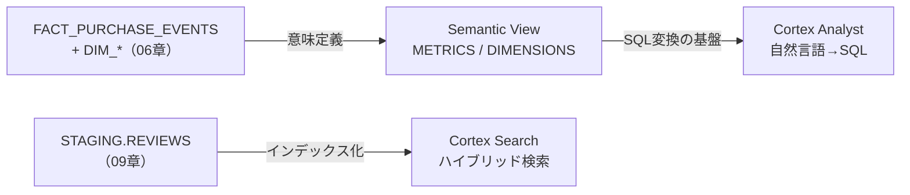

# 第10章: セマンティックビュー・Cortex Analyst・Cortex Search

> この章で実行するファイル: `sql/10_semantic_view_cortex.sql`

## この章で学ぶこと

- Semantic View でビジネス定義（メトリクス・ディメンション）をデータベースに登録する方法
- Cortex Analyst で自然言語の質問を SQL に変換する方法
- Cortex Search でテキストのハイブリッド検索サービスを構築する方法

## 前提条件

- 第6章（`sql/06_star_schema.sql`）が完了していること
  （`MART.FACT_PURCHASE_EVENTS`、`MART.DIM_USERS`、`MART.DIM_PRODUCTS` が存在すること）
- 第9章（`sql/09_ai_sql.sql`）が完了していること
  （`STAGING.REVIEWS` が存在すること）
- `SNOWFLAKE.CORTEX_USER` データベースロールが付与されていること

---

## 概念解説

### この章の 3 機能の位置づけ



---

### 1. Semantic View とは

**データベースに登録されたビジネス定義の集合体**です。

物理テーブルの列名や JOIN 条件はエンジニアしか知りませんが、Semantic View に登録することで「売上合計」「注文件数」「都道府県別集計」といったビジネス用語を SQL で正式に定義できます。

```
物理テーブル                    Semantic View が定義するもの
─────────────────               ─────────────────────────────
FACT_PURCHASE_EVENTS.line_amount  →  METRIC: total_sales = SUM(line_amount)
DIM_USERS.prefecture              →  DIMENSION: 都道府県
user_id（FK）→ DIM_USERS.user_id  →  RELATIONSHIP: FACT と DIM_USERS の結合条件
```

| 要素 | 説明 |
|---|---|
| `TABLES` | 対象テーブルを登録し、エイリアスと主キーを定義する |
| `RELATIONSHIPS` | テーブル間の結合条件（FK → PK）を宣言する |
| `DIMENSIONS` | 集計に使う「切り口」（誰が・何が・どこで） |
| `METRICS` | 集計する「値」（SUM/COUNT/AVG） |
| `FACTS` | 行レベルの補助属性（メトリクス・ディメンションの計算に利用） |

---

### 2. Cortex Analyst とは

**自然言語の質問を、Semantic View の定義に基づいて SQL に変換するAI機能**です。

```
ユーザーの質問（日本語可）
  「都道府県別の売上合計を教えて」
          │
          ▼
  Cortex Analyst（LLM + Semantic View）
          │
          ▼
  自動生成 SQL:
    SELECT u.prefecture, SUM(f.line_amount)
    FROM MART.FACT_PURCHASE_EVENTS f
    JOIN MART.DIM_USERS u ON f.user_id = u.user_id
    GROUP BY u.prefecture
```

アクセス方法: **REST API**（SQL 関数ではなく API 呼び出し）

- エンドポイント: `POST /api/v2/cortex/analyst/message`
- `semantic_view` パラメータに Semantic View の完全修飾名を指定する

---

### 3. Cortex Search とは

**テキストに対して全文検索（キーワード）とベクトル検索（意味的類似）を組み合わせたハイブリッド検索サービス**です。

```
STAGING.REVIEWS（テキストデータ）
        │
        │ CREATE CORTEX SEARCH SERVICE
        ▼
  STAGING.REVIEW_SEARCH（サービス）
  ┌─────────────────────────────────┐
  │  BM25（キーワードマッチ）         │
  │  + Embedding（意味的類似）        │
  │  → ハイブリッドスコアでランキング  │
  └─────────────────────────────────┘
        │
        │ SNOWFLAKE.CORTEX.SEARCH_PREVIEW()
        ▼
  "comfortable shoes" → r001 の結果を返す
```

| 比較項目 | 通常の LIKE 検索 | Cortex Search |
|---|---|---|
| 完全一致 | ◎ | ◎ |
| 部分一致 | ○ | ○ |
| 表記ゆれ対応 | ✗ | ○ |
| 意味的近さ | ✗ | ○（Embedding） |
| 設定の手間 | なし | サービス作成が必要 |

---

## ハンズオン手順

### Step 1: Semantic View を作成する

`FACT_PURCHASE_EVENTS`・`DIM_USERS`・`DIM_PRODUCTS` を使って、購買分析用の Semantic View を定義します。

```sql
CREATE OR REPLACE SEMANTIC VIEW MART.SEM_PURCHASE_EVENTS
  TABLES (
    fact     AS MART.FACT_PURCHASE_EVENTS PRIMARY KEY (event_id, sku),
    users    AS MART.DIM_USERS            PRIMARY KEY (user_id),
    products AS MART.DIM_PRODUCTS         PRIMARY KEY (sku)
  )
  RELATIONSHIPS (
    -- FACT の user_id が DIM_USERS の user_id を参照
    fact (user_id) REFERENCES users,
    -- FACT の sku が DIM_PRODUCTS の sku を参照
    fact (sku)     REFERENCES products
  )
  DIMENSIONS (
    fact.event_time_dim       AS fact.event_time,
    fact.category_dim         AS fact.category,
    users.user_name_dim       AS users.user_name,
    users.prefecture_dim      AS users.prefecture,
    products.product_name_dim AS products.product_name,
    products.category_dim     AS products.category
  )
  METRICS (
    -- ビジネス用語としてメトリクスを定義する
    fact.total_sales   AS SUM(fact.line_amount),
    fact.total_qty     AS SUM(fact.qty),
    fact.order_count   AS COUNT(DISTINCT fact.event_id),
    fact.avg_price     AS AVG(fact.price)
  )
;
```

確認:

```sql
DESCRIBE SEMANTIC VIEW MART.SEM_PURCHASE_EVENTS;
SHOW SEMANTIC VIEWS IN SCHEMA MART;
```

---

### Step 2: Cortex Analyst で自然言語クエリを実行する

Cortex Analyst は REST API で呼び出します。以下の Python スクリプトを **SQL 以外の環境**（ローカル PC、Snowsight の Python worksheet など）で実行してください。

```python
# pip install snowflake-connector-python が必要
import snowflake.connector
import requests
import json

# --- Snowflake 接続設定 ---
ACCOUNT   = "your-account.snowflakecomputing.com"   # 例: abc123.us-east-1
USER      = "your_user"
PASSWORD  = "your_password"
DATABASE  = "LEARN_DB"
SCHEMA    = "MART"
WAREHOUSE = "LEARN_WH"

# --- セッショントークンを取得 ---
conn = snowflake.connector.connect(
    account   = ACCOUNT,
    user      = USER,
    password  = PASSWORD,
    database  = DATABASE,
    schema    = SCHEMA,
    warehouse = WAREHOUSE,
)
token = conn.rest.token  # セッショントークン

# --- Cortex Analyst API 呼び出し ---
url = f"https://{ACCOUNT}/api/v2/cortex/analyst/message"

headers = {
    "Authorization": f'Snowflake Token="{token}"',
    "Content-Type":  "application/json",
}

payload = {
    "messages": [
        {
            "role": "user",
            "content": [
                {
                    "type": "text",
                    "text": "都道府県別の売上合計を教えてください"  # ← 質問を変えて試す
                }
            ]
        }
    ],
    "semantic_view": "LEARN_DB.MART.SEM_PURCHASE_EVENTS"
}

response = requests.post(url, headers=headers, json=payload)
result   = response.json()

# --- レスポンスを表示 ---
for content_block in result["message"]["content"]:
    if content_block["type"] == "text":
        print("AI の解釈:", content_block["text"])
    elif content_block["type"] == "sql":
        print("生成された SQL:\n", content_block["statement"])
```

**レスポンスの構造**:

```json
{
  "message": {
    "role": "analyst",
    "content": [
      { "type": "text", "text": "都道府県別の売上合計を集計します。" },
      { "type": "sql",  "statement": "SELECT u.prefecture, SUM(f.line_amount) ..." }
    ]
  }
}
```

> **Snowsight で試す場合**: Snowsight には Cortex Analyst の UI が組み込まれています。左メニューの **AI & ML** → **Cortex Analyst** から、Semantic View を選択して自然言語で質問できます。

---

### Step 3: Cortex Search サービスを作成する

`STAGING.REVIEWS` のレビューテキストをインデックス化して検索可能にします。

```sql
CREATE OR REPLACE CORTEX SEARCH SERVICE STAGING.REVIEW_SEARCH
  ON         review_text          -- 検索対象の列（全文+ベクトルでインデックス化）
  ATTRIBUTES user_id              -- フィルタリングに使える列
  WAREHOUSE  = LEARN_WH
  TARGET_LAG = '1 day'           -- ベーステーブルとの最大遅延
AS
  SELECT review_id, user_id, review_text
  FROM STAGING.REVIEWS;
```

確認:

```sql
SHOW CORTEX SEARCH SERVICES IN SCHEMA STAGING;
DESCRIBE CORTEX SEARCH SERVICE STAGING.REVIEW_SEARCH;
```

---

### Step 4: Cortex Search で検索する

SQL の `SNOWFLAKE.CORTEX.SEARCH_PREVIEW` 関数で検索クエリを発行します。

```sql
-- 「comfortable shoes」に意味的に近いレビューを検索
SELECT
  SNOWFLAKE.CORTEX.SEARCH_PREVIEW(
    'STAGING.REVIEW_SEARCH',
    '{
      "query":   "comfortable shoes",
      "columns": ["review_id", "user_id", "review_text"],
      "limit":   3
    }'
  ) AS search_results;
```

レスポンスは JSON 文字列として返るため、`parse_json(...)` してからフラット化します。

```sql
SELECT
  r.value:review_id::STRING    AS review_id,
  r.value:user_id::STRING      AS user_id,
  r.value:review_text::STRING  AS review_text
FROM (
  SELECT parse_json(SNOWFLAKE.CORTEX.SEARCH_PREVIEW(
    'STAGING.REVIEW_SEARCH',
    '{"query": "comfortable shoes", "columns": ["review_id","user_id","review_text"], "limit": 3}'
  )) AS raw
),
LATERAL FLATTEN(INPUT => raw:results) r;
```

ユーザー ID でフィルタしながら検索:

```sql
SELECT SNOWFLAKE.CORTEX.SEARCH_PREVIEW(
  'STAGING.REVIEW_SEARCH',
  '{
    "query":   "delivery problem",
    "columns": ["review_id", "review_text"],
    "filter":  {"@eq": {"user_id": "u002"}},
    "limit":   5
  }'
) AS filtered_results;
```

---

## 確認クエリ

```sql
-- Semantic View の定義確認
DESCRIBE SEMANTIC VIEW MART.SEM_PURCHASE_EVENTS;
SHOW SEMANTIC VIEWS IN SCHEMA MART;

-- Cortex Search サービスの確認
SHOW CORTEX SEARCH SERVICES IN SCHEMA STAGING;

-- 検索テスト（コーヒー関連のレビューを探す）
SELECT SNOWFLAKE.CORTEX.SEARCH_PREVIEW(
  'STAGING.REVIEW_SEARCH',
  '{"query": "coffee aroma", "columns": ["review_id","review_text"], "limit": 3}'
) AS results;
```

---

## Try This

1. **（ステップ1 必須）Semantic View にメトリクスを追加してみる**

   `SUM(fact.qty)` を「総購入数量」として `fact.total_qty` に定義したあと、
   Cortex Analyst に「SKU 別の総購入数量を教えてください」と質問してみましょう。

2. **（ステップ2 発展）Cortex Search の検索クエリを変えてみる**

   `"query": "coffee aroma"` を `"query": "setup instructions confusing"` に変えて、
   ベクトル検索が意味的に近いレビューを見つけることを確認してみましょう。

---

## まとめ

| 機能 | 何をするか | アクセス方法 |
|---|---|---|
| Semantic View | ビジネス定義（メトリクス・ディメンション・リレーション）をDBに登録 | SQL DDL（CREATE SEMANTIC VIEW） |
| Cortex Analyst | Semantic View を使って自然言語 → SQL を自動生成 | REST API / Snowsight UI |
| Cortex Search | テキストを全文+ベクトルでハイブリッド検索 | SQL（SEARCH_PREVIEW）/ REST API |

次の章では、01〜10章で構築したパイプライン全体を俯瞰して確認します。

## 参考リンク

- [Semantic View の概要](https://docs.snowflake.com/ja/user-guide/views-semantic/overview)
- [CREATE SEMANTIC VIEW](https://docs.snowflake.com/ja/sql-reference/sql/create-semantic-view)
- [Semantic View のベストプラクティス](https://docs.snowflake.com/ja/user-guide/views-semantic/best-practices-dev)
- [Cortex Analyst の概要](https://docs.snowflake.com/ja/user-guide/snowflake-cortex/cortex-analyst)
- [Cortex Analyst REST API](https://docs.snowflake.com/ja/user-guide/snowflake-cortex/cortex-analyst/rest-api)
- [Cortex Search の概要](https://docs.snowflake.com/ja/user-guide/snowflake-cortex/cortex-search/cortex-search-overview)
- [CREATE CORTEX SEARCH SERVICE](https://docs.snowflake.com/ja/sql-reference/sql/create-cortex-search)
- [SEARCH_PREVIEW 関数](https://docs.snowflake.com/ja/sql-reference/functions/search_preview-snowflake-cortex)

## 学習チェックリスト

- [ ] Semantic View を作成して METRICS / DIMENSIONS を定義できた
- [ ] Cortex Analyst に自然言語でクエリを投げられた
- [ ] Cortex Search サービスを作成してハイブリッド検索ができた
- [ ] 3機能（Semantic View / Analyst / Search）の使い分けを説明できる
