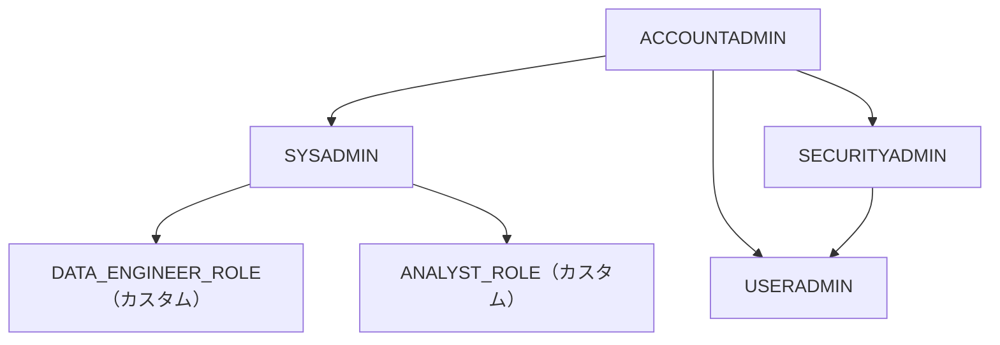

# 付録A3: セキュリティ・RBAC・データマスキング

> **SnowPro Core 対策** — Domain 2: Account Access and Security（20%）

---

## この章で学ぶこと

- Snowflake のシステム定義ロール 5 種の役割と権限
- RBAC の設計パターン（ロール階層の組み方）
- Dynamic Data Masking で列単位のアクセス制御
- Row Access Policy で行単位のアクセス制御
- Network Policy で接続元 IP を制限する方法

---

## 概念解説

### 1. システム定義ロール（5 種）

Snowflake には最初から用意されている 5 つのシステムロールがあります。

| ロール | 主な権限 | 推奨用途 |
|---|---|---|
| **ACCOUNTADMIN** | アカウント全体の管理（課金・ユーザー・全オブジェクト） | 最小人数の管理者のみ |
| **SYSADMIN** | データベース・ウェアハウス・オブジェクトの作成・管理 | データエンジニア・DBA |
| **SECURITYADMIN** | ユーザー・ロールの管理、権限の付与・取り消し | セキュリティ担当者 |
| **USERADMIN** | ユーザーとロールの作成 | ユーザー管理者 |
| **PUBLIC** | 全ユーザーが自動で持つデフォルトロール | 最低限のパブリック権限 |

```
ACCOUNTADMIN（最上位）
├── SYSADMIN
│   ├── DATA_ENGINEER_ROLE（カスタム）
│   └── ANALYST_ROLE（カスタム）
├── SECURITYADMIN
│   └── USERADMIN
└── PUBLIC
```



#### なぜカスタムロールを SYSADMIN 配下に置くか

- **権限継承**: SYSADMIN はデータベース・ウェアハウスの所有権を持つ。配下のカスタムロールは SYSADMIN を通じてそれらを操作できる
- **最小権限の原則**: ACCOUNTADMIN は請求・アカウント設定など強力な権限を持つため、日常業務では使わない
- **SECURITYADMIN 配下は NG**: SECURITYADMIN はユーザー管理専用。データ操作権限とは分離する

#### ロール設計例

| ロール | 用途 | 付与する権限 |
|--------|------|-------------|
| `ANALYST_ROLE` | レポート・ダッシュボード作成者 | SELECT on ANALYTICS schema |
| `DEVELOPER_ROLE` | アプリ開発者 | SELECT / INSERT on RAW / STAGING |
| `DATA_ENGINEER_ROLE` | パイプライン構築・管理 | USAGE on Warehouse + CREATE TABLE 等 |

> **試験頻出**: カスタムロールは必ず **SYSADMIN 以上に GRANT** する。しないと ACCOUNTADMIN でもオブジェクトが見えないことがある。

---

### 2. RBAC の設計パターン

**RBAC（Role-Based Access Control）** は「ユーザーに直接権限を付けず、ロールを介して権限を管理する」考え方です。

```
ユーザー → ロール → 権限
                 └── データベース USAGE
                 └── スキーマ USAGE
                 └── テーブル SELECT
```

**権限の種類（よく使うもの）**:

| 権限 | 対象 | 内容 |
|---|---|---|
| `USAGE` | データベース・スキーマ・ウェアハウス | 利用を許可（SELECT には別途 SELECT 権限が必要） |
| `SELECT` | テーブル・ビュー | 読み取りを許可 |
| `INSERT` / `UPDATE` / `DELETE` | テーブル | 書き込み・更新・削除を許可 |
| `CREATE TABLE` | スキーマ | スキーマ内でのテーブル作成を許可 |
| `OWNERSHIP` | オブジェクト | オブジェクトの所有権（権限付与が可能になる） |

---

### 3. Dynamic Data Masking

列単位でデータをマスクする機能。**ロールに応じて表示内容を変えられます**。

```
SYSADMIN でクエリ実行:     user_id = "user_abc_123"
ANALYST_ROLE でクエリ実行: user_id = "***********"
```

- Enterprise 以上が必要
- `MASKING POLICY` オブジェクトを作成 → 列に `SET MASKING POLICY` で適用
- 1 列に適用できるポリシーは **1 つだけ**

---

### 4. Row Access Policy

行単位でアクセスを制御する機能。ロールやユーザーに応じて返す行を絞り込みます。

```
SYSADMIN でクエリ実行:     全商品の購入データ（全行）
ANALYST_ROLE でクエリ実行: sku が 'A' で始まる商品のみ（一部の行）
```

- Enterprise 以上が必要
- `ROW ACCESS POLICY` オブジェクトを作成 → テーブルに `ADD ROW ACCESS POLICY` で適用
- 対象列の値を引数に取り、`TRUE`（行を返す）/ `FALSE`（行を隠す）を返す関数として定義

---

### 5. Network Policy

接続を許可する IP アドレス範囲を制限します。

```
許可リスト: 203.0.113.0/24（オフィスのIPレンジ）
       ↓
このレンジ以外からのログインはブロック
```

- アカウントレベル / ユーザーレベルで適用可能
- `ACCOUNTADMIN` 権限が必要
- `ALLOWED_IP_LIST`（許可）と `BLOCKED_IP_LIST`（拒否）を組み合わせられる

---

## ハンズオン

**A3_security_rbac.sql** を開き、上から順に実行してください。

### Step 1: カスタムロールを作成する

```sql
CREATE ROLE IF NOT EXISTS ANALYST_ROLE;
GRANT ROLE ANALYST_ROLE TO ROLE SYSADMIN;  -- ロール階層に組み込む
GRANT ROLE ANALYST_ROLE TO USER <your_user>;
```

### Step 2: オブジェクト権限を付与する

```sql
GRANT USAGE ON DATABASE LEARN_DB TO ROLE ANALYST_ROLE;
GRANT USAGE ON SCHEMA LEARN_DB.MART TO ROLE ANALYST_ROLE;
GRANT SELECT ON TABLE LEARN_DB.MART.FACT_PURCHASE_EVENTS TO ROLE ANALYST_ROLE;
SHOW GRANTS TO ROLE ANALYST_ROLE;
```

### Step 3: Dynamic Data Masking を設定する

```sql
CREATE OR REPLACE MASKING POLICY STAGING.MASK_USER_ID ...;
ALTER TABLE MART.FACT_PURCHASE_EVENTS
  MODIFY COLUMN user_id SET MASKING POLICY STAGING.MASK_USER_ID;
```

ANALYST_ROLE で SELECT すると `user_id` がマスクされます。

### Step 4: Row Access Policy を設定する

```sql
CREATE OR REPLACE ROW ACCESS POLICY STAGING.ROW_POLICY_BY_SKU ...;
ALTER TABLE MART.FACT_PURCHASE_EVENTS
  ADD ROW ACCESS POLICY STAGING.ROW_POLICY_BY_SKU ON (sku);
```

### Step 5: Network Policy を確認する（概念確認）

```sql
CREATE OR REPLACE NETWORK POLICY ALLOW_OFFICE_IPS
  ALLOWED_IP_LIST = ('203.0.113.0/24');
SHOW NETWORK POLICIES;
```

---

## 試験対策ポイント

- **ACCOUNTADMIN**: 最小人数で管理。日常業務には使わない
- **カスタムロール**: `GRANT ROLE <custom> TO ROLE SYSADMIN` で階層に組み込む（必須）
- **Dynamic Data Masking**: 列単位・Enterprise 以上・1 列に 1 ポリシー
- **Row Access Policy**: 行単位・Enterprise 以上・関数が `BOOLEAN` を返す
- **SECURITYADMIN vs USERADMIN**: SECURITYADMIN はより広い権限（GRANT/REVOKE も可能）
- **Network Policy**: IP による接続制限・アカウント/ユーザー両レベルで設定可能
