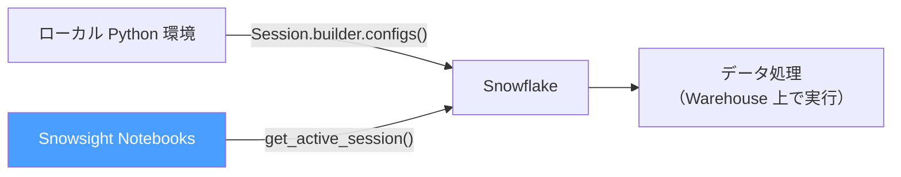

# 付録A6: Snowpark 入門（Python）

> **SnowPro Core 対策** — Domain 3: Data Loading and Transformation（20%）

---

## この章で学ぶこと

- Snowpark とは何か（SQL との違い・実行場所）
- Python DataFrame API の基本的な使い方
- Snowpark で UDF（ユーザー定義関数）を定義する方法
- 試験対策として押さえるべき Snowpark の特徴

> **注意**: この付録には SQL ファイルはありません。コード例は参考として掲載しています。
> 実際に試すには、Snowsight の「Notebooks」機能（Python 実行環境）または
> ローカルの Python 環境に `snowflake-snowpark-python` をインストールしてください。

---

## 概念解説

### 1. Snowpark とは

Snowpark は、Python / Java / Scala のコードで Snowflake のデータを操作するフレームワークです。

```
通常の SQL の場合:
  ユーザー → SQL 文字列を送信 → Snowflake が実行 → 結果を返す

Snowpark の場合:
  ユーザー → Python コード（DataFrame API）→
  Snowpark が SQL に変換 → Snowflake（Warehouse）が実行 → 結果を返す
```

**重要**: Snowpark のコードは **Snowflake の Warehouse 上で実行されます**。
クライアントの Python 環境では実行されません（データをクライアントに持ってこない）。

---

### 2. SQL との違い

| 観点 | SQL | Snowpark |
|---|---|---|
| 記述言語 | SQL | Python / Java / Scala |
| 実行場所 | Snowflake Warehouse | Snowflake Warehouse（同じ） |
| データ転送 | なし | なし |
| 得意な処理 | 集計・結合・変換 | 複雑なロジック・ML・UDF |
| 学習コスト | 低い | 高い（Python/Java の知識が必要） |

---

### 3. 典型的なユースケース

1. **Python UDF の定義**: SQL から呼び出せる Python 関数を Snowflake に登録
2. **機械学習**: Snowflake の Warehouse 内でモデルの学習・推論を実行
3. **複雑な変換**: Python の数学ライブラリ（numpy, pandas 等）を使った変換処理
4. **Stored Procedure の Python 実装**: 05 章で学んだストアドプロシージャを Python で書く

---

## Snowpark Python のサンプルコード

### 基本的な接続とデータ操作

```python
from snowflake.snowpark import Session
from snowflake.snowpark import functions as F

# Snowflake への接続
session = Session.builder.configs({
    "account":   "your_account_identifier",
    "user":      "your_username",
    "password":  "your_password",
    "database":  "LEARN_DB",
    "schema":    "MART",
    "warehouse": "LEARN_WH",
    "role":      "SYSADMIN"
}).create()

# テーブルを DataFrame として読み込む
df = session.table("FACT_PURCHASE_EVENTS")

# カテゴリ別の売上集計（SQL の GROUP BY に相当）
result = (
    df
    .group_by("category")
    .agg(
        F.sum("line_amount").alias("total_sales"),
        F.count("*").alias("transaction_count")
    )
    .sort(F.col("total_sales").desc())
)

# 結果を表示（Snowflake 上で実行・結果だけをクライアントに返す）
result.show()

# Snowflake のテーブルに書き込む
result.write.save_as_table("MART.SALES_BY_CATEGORY", mode="overwrite")
```

### Python UDF の定義と SQL からの呼び出し

```python
from snowflake.snowpark.functions import udf
from snowflake.snowpark.types import StringType, FloatType

# Python 関数を UDF として Snowflake に登録
@udf(name="format_amount_jpy",
     return_type=StringType(),
     input_types=[FloatType()],
     replace=True)
def format_amount_jpy(amount: float) -> str:
    """金額を日本円フォーマットで返す"""
    return f"¥{int(amount):,}"

# 登録した UDF を SQL から呼び出す
session.sql("""
    SELECT
        event_id,
        line_amount,
        format_amount_jpy(line_amount) AS formatted_amount
    FROM MART.FACT_PURCHASE_EVENTS
    LIMIT 5
""").show()
```

### Snowsight Notebooks での実行例

Snowsight には Jupyter ノートブック風の「Notebooks」機能があります。
Notebooks では追加のインストール不要で Snowpark が使えます。

```python
# Notebooks ではセッションが事前に用意されている
from snowflake.snowpark.context import get_active_session
session = get_active_session()

# あとは通常の Snowpark コードと同じ
df = session.table("MART.FACT_PURCHASE_EVENTS")
df.show(5)
```

#### 実行環境の比較



| 項目 | ローカル環境 | Snowsight Notebooks |
|------|-------------|---------------------|
| セットアップ | Python 環境構築 + ライブラリインストール | ブラウザのみ |
| 接続設定 | `Session.builder.configs()` で認証情報を記述 | `get_active_session()` で自動取得 |
| 向いている場面 | CI/CD・バッチ処理・ローカルデバッグ | 探索的分析・プロトタイプ・共有 |

---

## Snowpark と Stored Procedure の関係

05 章で SQL で書いたストアドプロシージャは、Python でも書けます。

```python
# Python Stored Procedure の定義
def merge_events_python(session: Session) -> str:
    """Python で書いた Stored Procedure"""
    source = session.table("RAW.RAW_EVENTS_STREAM")
    target = session.table("MART.FACT_PURCHASE_EVENTS")

    # MERGE 処理（Snowpark の merge API を使用）
    target.merge(
        source,
        target["event_id"] == source["event_id"],
        [
            # マッチした場合: スキップ
            # マッチしない場合: INSERT
        ]
    )
    return "merge completed"

# Stored Procedure として登録
session.sproc.register(
    func=merge_events_python,
    name="SP_MERGE_EVENTS_PYTHON",
    replace=True
)

# SQL から呼び出し
# CALL SP_MERGE_EVENTS_PYTHON();
```

---

## 試験対策ポイント

- **実行場所**: Snowpark のコードは **Warehouse 上で実行**（クライアントではない）
- **言語サポート**: Python / Java / Scala（2026年時点）
- **データ転送なし**: データを Snowflake の外に持ち出さずに処理可能
- **UDF登録**: Python UDF を登録すると SQL から `CALL` 可能
- **Vectorized UDF**: pandas の Series を受け取って効率よく処理できる UDF（通常 UDF より高速）
- **Snowpark ML**: Snowflake 内で機械学習モデルを学習・デプロイする機能
- **Notebooks**: Snowsight の組み込み Jupyter 環境（Snowpark が標準で使える）
- **Streamlit in Snowflake**: Snowpark と組み合わせてデータアプリを Snowflake 内でホスト

---

## Snowpark ML 入門

Snowpark ML は、Snowflake 上で機械学習モデルの学習・推論を実行するためのフレームワーク。

### Snowpark ML の位置づけ

| コンポーネント | 役割 |
|--------------|------|
| `snowflake.ml.modeling` | scikit-learn 互換の前処理・モデル学習 API |
| `snowflake.ml.registry` | モデルのバージョン管理・デプロイ |
| Snowpark ML Functions | SQL から呼び出せる ML 推論関数 |

### 基本的な使い方（概念）

```python
from snowflake.ml.modeling.preprocessing import StandardScaler
from snowflake.ml.modeling.linear_model import LinearRegression

# Snowpark DataFrame をそのまま使える
scaler = StandardScaler(input_cols=["AMOUNT"], output_cols=["AMOUNT_SCALED"])
df_scaled = scaler.fit(df).transform(df)

model = LinearRegression(input_cols=["AMOUNT_SCALED"], label_cols=["TARGET"])
model.fit(df_scaled)
```

> **補足**: Snowpark ML の詳細は [Snowflake 公式ドキュメント](https://docs.snowflake.com/ja/developer-guide/snowpark-ml/index) を参照。

---

## 参考リソース

- [Snowpark Python API リファレンス（Snowflake ドキュメント）](https://docs.snowflake.com/ja/developer-guide/snowpark/python/index)
- [Snowflake Notebooksについて](https://docs.snowflake.com/ja/user-guide/ui-snowsight/notebooks)
- [Snowpark ML ドキュメント](https://docs.snowflake.com/ja/developer-guide/snowflake-ml/overview)
