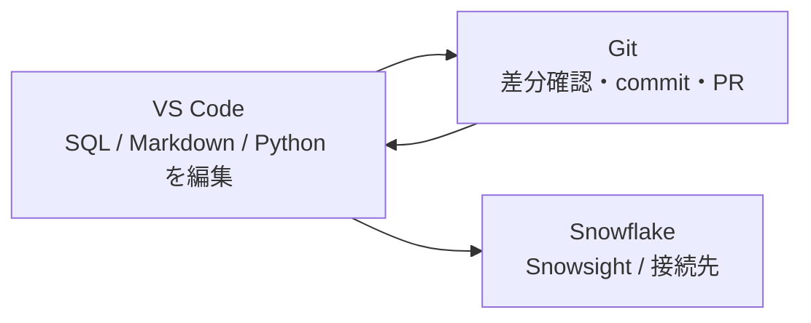

# 付録A7: Snowsight の次へ、VS Code で Snowflake を開発する

> この付録は「読むだけ」で進められます。ローカル PC に VS Code を入れて試すと理解が深まります。

## この付録で学ぶこと

- Snowsight と VS Code の使い分け
- VS Code を使うと何が楽になるのか
- SQL / Markdown / Git を 1 つの場所で扱う開発スタイル
- VS Code と Git を組み合わせて安全に変更する流れ
- Snowflake 拡張機能を使うときの基本イメージ
- この教材を「試す」から「育てる」に変える視点

## まず結論

Snowsight は **試す場所** として優秀です。  
VS Code は **育てる場所** として優秀です。

最初の学習では Snowsight だけでも十分です。ただし、教材や SQL が増えてくると次の痛みが出ます。

- どの SQL をどこで直したか追いにくい
- Markdown の説明文と SQL を一緒に直しにくい
- Git の差分やレビューを前提にした作業がしづらい
- dbt や Snowpark まで広がると、ブラウザだけでは管理が苦しくなる

この「少しずつつらくなる感じ」を解決するのが VS Code です。

---

## こんな人に刺さる

次のどれかに当てはまるなら、VS Code 連携を知っておく価値があります。

1. SQL を試すだけでなく、ファイルとして整理したい
2. 教材や手順書も含めて Git で管理したい
3. dbt や Snowpark も同じエディタで触りたい
4. 変更差分を見ながら安全に直したい
5. 将来的に PR ベースでレビューしたい

---

## Snowsight だけだと何が起きるか

たとえば第6章まで進んだあと、売上分析 SQL を少しずつ改良したいとします。

最初はこう考えます。

> 「Snowsight の worksheet で十分では？」

実際、最初の 1 本は十分です。ですが 5 本、10 本と増えると次のようになります。

- 似た SQL が増えて、どれが最新版か分からなくなる
- 教材本文の説明と SQL 本体がずれてくる
- ちょっとした修正でも「何を変えたか」を説明しづらい
- 同じ修正を README にも SQL にも入れたいときに面倒になる

つまり、**実行環境としての快適さ** と **開発環境としての快適さ** は別です。

---

## VS Code を使うとどう変わるか



VS Code を使うと、1 つの画面で次をまとめて扱えます。

- `sql/*.sql` の編集
- `sql/*.md` の教材文の更新
- `dbt/` のモデル修正
- `airflow/` の Python コード確認
- Git diff と commit

この教材との相性が良い理由は、教材そのものが **「SQL と説明文のセット」** だからです。

---

## Snowsight と VS Code の役割分担

| ツール | 向いていること | ひとこと |
|---|---|---|
| Snowsight | すぐ実行、結果確認、可視化、その場で試す | 実験室 |
| VS Code | ファイル編集、差分確認、構成管理、レビュー準備 | 開発机 |
| Git | branch、commit、履歴管理、差分の追跡 | 作業の安全装置 |
| GitHub | Issue、PR、履歴、レビュー | チームの記録 |

いちばん自然な使い方は次です。

1. VS Code で SQL と教材文を直す
2. Snowsight でその SQL を実行して確かめる
3. Git で差分を見て、変更を小さく commit する
4. GitHub に PR を出す

---

## 最小構成で始める

VS Code 連携は、最初から全部そろえなくてもよいです。

### まず必要なもの

1. VS Code
2. このリポジトリを開く
3. SQL と Markdown を編集できる状態

この時点で、すでに次の価値があります。

- 複数ファイルを横断して検索できる
- 差分を見ながら説明文を直せる
- issue ごとに branch を切る運用に乗せやすい

### 追加すると便利なもの

1. Snowflake 拡張機能
2. GitHub Pull Requests 拡張
3. dbt / Python 系の補助拡張

---

## 体験シナリオ

この付録は、次の 10 分ハンズオンで体験するとイメージしやすいです。

### Step 1: この教材フォルダを VS Code で開く

見たいのは次の 3 つです。

- `sql/06_star_schema.sql`
- `sql/06_5_views.md` のような教材文
- `README.md`

ここで「SQL だけではなく、説明文も同じ場所にある」ことが VS Code の強みです。

### Step 2: SQL を 1 行だけ直す

たとえば `sql/07_cost_optimization.sql` にコメントを 1 行足します。

```sql
-- 学習用では XSMALL と短い auto_suspend から始める
```

Snowsight でもできますが、VS Code だと「今どこを変えたか」がすぐ見えます。

### Step 3: Git diff を見る

ここが大きな違いです。

```bash
git diff
```

差分を見ると、

- 何を変更したか
- 余計な変更が混ざっていないか
- レビュー時に何を説明すべきか

が一瞬で分かります。

### Step 4: 小さく commit する

差分が確認できたら、変更を小さく区切って commit します。

```bash
git checkout -b docs/update-cost-note
git add sql/07_cost_optimization.sql sql/07_cost_optimization.md
git commit -m "docs: clarify cost optimization note"
```

この流れに慣れると、次の価値が出ます。

- 変更の意図をあとから追える
- レビュー時に説明しやすい
- 失敗しても、どこまで直したか戻りやすい

### Step 5: PR につなげる

commit までできれば、あとは GitHub に push して PR を作るだけです。

この教材を「読むだけ」で終わらせず、改善提案を積み上げる運用に自然につながります。

### Step 6: Markdown も一緒に直す

SQL を変えたなら、教材本文も合わせて直すべきことが多いです。

たとえば `sql/07_cost_optimization.md` に注意書きを 1 行足します。

この「SQL と説明文を同時に直す」作業は、VS Code だとかなり自然です。

---

## Snowflake 拡張機能で何ができるか

拡張機能の詳細手順は環境差があるのでここでは最小限に留めますが、考え方はシンプルです。

### できることのイメージ

1. Snowflake への接続先を登録する
2. VS Code から SQL を送る
3. 結果や接続先を確認する

すべてを VS Code に寄せる必要はありません。  
**編集は VS Code、実験は Snowsight** の分担でも十分です。

---

## この教材との相性が良い場面

### 1. 章末の改善

Issue を見ながら、`sql/*.md` と `sql/*.sql` を同時に直せます。

### 2. dbt に進む前

dbt はファイルベースの開発なので、VS Code に慣れておくと移行が自然です。

### 3. Snowpark に進む前

Python ファイルと SQL とドキュメントを一緒に扱う練習になります。

### 4. PR ベースの開発

「教材を育てる」「レビューを受ける」流れが作れます。VS Code と Git を組み合わせることで、Issue ごとに branch を切り、差分を小さく保ったまま PR に乗せやすくなります。

---

## よくあるつまずき

| 症状 | 原因 | 対処法 |
|---|---|---|
| VS Code にしたのに楽にならない | Snowsight の代替としてしか見ていない | VS Code は実行 UI ではなく、編集・差分確認・構成管理に強いと捉える |
| SQL だけ直して本文を直し忘れる | 作業対象をコードだけに絞ってしまう | `sql/*.sql` と `sql/*.md` をセットで確認する |
| Git が怖い | 変更単位が大きすぎる | 1 Issue = 1 branch = 1 小さな差分 で進める |
| commit が雑になってレビューしづらい | 変更をまとめて入れすぎている | 「SQL 修正」「教材本文修正」など意図ごとに小さく区切って commit する |

---

## まとめ

| 視点 | VS Code を使う価値 |
|---|---|
| 学習 | SQL の実験を「再現可能なファイル」に変えられる |
| 開発 | SQL / Markdown / Python を同じ場所で管理できる |
| Git 連携 | branch、diff、commit を通じて安全に変更できる |
| レビュー | Git diff と PR に乗せやすい |
| 発展 | dbt、Snowpark、Airflow につなげやすい |

**ひとことで言うと**:

Snowsight は「その場で動かす力」をくれます。  
VS Code は「変更を育てる力」をくれます。

## 参考リンク

- [Visual Studio Code 公式サイト](https://code.visualstudio.com/)
- [Snowflake SQL API の概要](https://docs.snowflake.com/en/developer-guide/sql-api/index)
- [GitHub Pull Requests and Issues for VS Code](https://code.visualstudio.com/docs/sourcecontrol/github)
